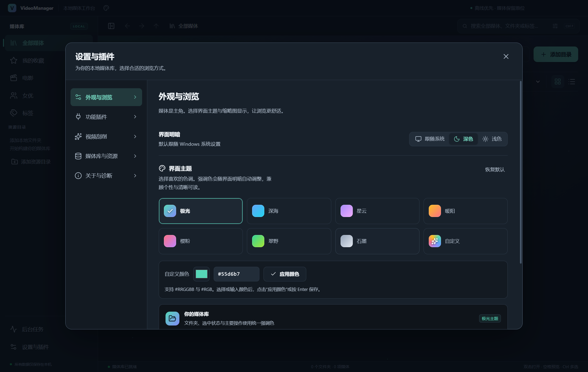

<div align="center">
  
  <h1>VideoManager</h1>
  <p><strong>离线优先的 Windows 本地图片与视频管理工作台</strong></p>
  <p>保留原有文件结构，用封面、标签、收藏与统一视图整理你的本地媒体库。</p>

  <p>
    
    
    
    <a href="LICENSE"></a>
    
    
  </p>
</div>

---

## ✨ 项目简介

VideoManager 是一款面向 Windows 的本地多媒体管理软件。它直接连接电脑中的图片和视频文件夹，不复制原始媒体，也不要求登录账号或连接云端服务。

应用会在本机建立媒体索引，并保存标签、收藏、播放进度、文件夹封面和视频封面等管理信息。即使磁盘暂时离线，已有索引和缓存封面仍然可以浏览。

> [!IMPORTANT]
> 重命名、移动和移入回收站会真实修改磁盘文件。VideoManager 会在执行前展示影响范围，并通过冲突检测、跨盘校验和操作记录降低误操作风险。

---

## 🌟 核心特性

- **本地媒体库** — 直接纳管现有文件夹，媒体保留在原位置，无需导入副本。
- **现代视觉界面** — 保留 AceternityUI 风格的静态主题渐变与柔和光晕，统一图标、中文字体、按钮与卡片层次；媒体网格和播放弹窗取消持续流光、大面积背景模糊及鼠标追踪，减少浏览和播放时的渲染负担，支持系统「减少动态」设置。
- **多主题工坊** — 内置 7 组双色调主题预设（极光、深海、星云、暖阳、樱粉、翠野、石墨），支持标题栏快捷切换、方向键选择及自定义颜色；强调色与主要按钮文字自动适配深浅模式对比度，设置保存在当前媒体库中。
- **图片与视频统一浏览** — 网格和详细列表两种布局，文件夹与直属媒体分区展示。
- **高效索引** — 后台扫描、文件变化监听、任务进度显示和大列表虚拟化。
- **多维搜索** — 支持按文件名、文件夹名、路径和标签搜索，并可组合类型、扩展名、大小、日期、时长及收藏状态筛选。
- **内置查看器** — 连续浏览图片和视频，支持缩放、旋转、倍速播放、续播和全屏模式。
- **自定义封面** — 文件夹和视频均可设置封面；支持推荐候选、外部图片以及视频精确选帧。
- **视频刮削** — 按影片编号自动匹配标题、封面、发行日期、片商、系列、演员与标签；内置 JavBus、JavDB 等 7 个数据源并发查询，支持手动选优、批量刮削与封面自动应用。刮削到的标签自动并入标签系统，所在文件夹的封面同步替换；对 FC2 等特殊编号格式做了准确识别与防御性校验。
- **电影列表** — 资源库中已刮削的影片以卡片网格集中呈现：编号、名称、发行日期、时长、演员与标签一应俱全；卡片宽度自适应加宽，最多完整展示 8 个标签；编号以黑色加粗突出，支持按最近入库、编号、发行日期、时长、名称排序；点击卡片在当前页面弹出播放窗口，可在播放器内沿当前排序前后切换影片。
- **演员列表** — 视频刮削到的演员自动聚合为卡片网格：作品数量、生日与年龄、身高等资料一目了然；资料在后台按名字与已刮削的影片编号自动多源聚合补全（含日文名、中文名），也支持手动编辑资料或从关联作品中挑选一张封面作为演员头像；点击卡片即可查看该演员的全部作品。
- **标签总览** — 侧边栏标签入口打开总览弹窗，展示全部标签及媒体数量，支持搜索与按数量排序，点击任意标签直达对应视频集合。
- **标签与收藏** — 管理信息独立存储，不修改原始媒体文件。
- **安全文件操作** — 支持重命名、移动和移入系统回收站；跨盘移动会进行 SHA-256 校验。
- **离线与重绑** — 磁盘离线时保留管理数据，迁移媒体后可重新绑定资源根目录。
- **媒体库迁移** — 可导出和导入 `.vmlibrary` 管理包，不在管理包中复制原始媒体。
- **可扩展架构** — 导航、内容布局、查看器、封面策略和文件操作通过插件槽位组织。

---

## 🚀 快速开始

### 安装应用

1. 前往项目的 [GitHub Releases](../../releases/latest) 页面。
2. 下载 `VideoManager-<版本>-Windows-x64-Setup.exe`。
3. 运行安装程序，并按向导选择安装位置。

> [!NOTE]
> 当前安装包尚未进行数字签名，Windows SmartScreen 可能显示安全提示。请只从本项目的正式 Release 页面下载安装包。

### 添加媒体目录

1. 启动 VideoManager，点击 **添加资源目录**。
2. 选择图片和视频所在的本地文件夹。
3. 应用将在后台建立索引；可在 **后台任务** 中查看扫描进度。
4. 使用 **当前目录**、**包含子目录** 或 **整个媒体库** 切换浏览范围。

### 界面主题

应用内置 **7 组双色调主题预设**，两种方式随时切换：

- **快捷切换**：点击标题栏调色板图标，即可预览并切换主题预设与深浅模式。
- **主题工坊**：在 **设置与插件 → 外观与浏览 → 界面主题** 中选择预设，或通过调色板与十六进制值自定义强调色。

点击 **自定义** 即可从当前预设开始编辑。颜色选择器和文本输入共享草稿，支持 `#RRGGBB` 与 `#RGB`；点击 **应用颜色** 或按 `Enter` 保存。无效输入会显示提示并保留已应用主题。选择预设或 **恢复默认** 会清除自定义色。

每组主题拥有专属的静态渐变与光晕；自定义颜色会自动派生搭档渐变。所有颜色自动适配深浅主题并保存在当前媒体库中，重启后继续生效。

### v0.9.2 更新

- 修复首次点击自定义主题无效，以及颜色输入失焦与应用按钮竞争的问题。
- 取消永久极光动画、卡片流光、全局鼠标聚光灯和播放弹窗背景模糊；移除逐字动画运行时，媒体网格避免因弹窗或任务状态改变重复渲染。
- mpv 画面尺寸通过窗口、全屏与布局变化事件同步，取消逐帧尺寸轮询，保持原生画面与弹窗对齐。
- 重整深浅色界面层次、主题预设卡片、颜色编辑区、字体、图标、焦点状态与播放器控件；保存外观设置时保持媒体查询与滚动位置。
- 修复清理缩略图缓存与后台封面生成的写入竞争；清理期间的新预览请求会等待，手动封面对象继续保留。
- 同机 44 项媒体样本、多选 12 项后，2 秒空闲主线程耗时由约 562 ms 降至 27 ms，持续动画由 17 个降至 0 个；该指标不包含 GPU 时间，也不代表所有媒体库与编码。



完整功能回归、安装包校验及性能口径见 [v0.9.2 验收记录](docs/RELEASE_v0.9.2.md)。

### 选择视频播放器

在 **设置与插件 → 功能插件 → 视频播放方式** 中选择：

- **Chromium**：在应用内播放，保留现有倍速、续播及全屏操作。
- **mpv**：随安装包提供，在应用内同一个播放弹窗中播放，支持更广泛的容器与编码、字幕及音轨切换。应用内可控制暂停、定位、倍速、音量、全屏及选帧，并保存播放进度。全屏采用 mpv 原生浮动控制器，自动显隐时保持视频区域尺寸不变。
- **系统默认应用**：遵循 Windows 文件关联；播放控制和进度由外部应用管理。

三种方式以互斥功能插件提供，选择保存在当前媒体库中。关闭查看器或切换媒体库时，应用会关闭自己启动的 mpv 会话；不会结束用户另行启动的播放器。

### 整理媒体

- 双击图片或视频进入查看器。
- 右键媒体卡片可收藏、编辑标签、设置封面或定位文件。
- 对视频选择 **设置封面**，可播放定位并精确选择某一帧。
- 使用顶部搜索框查询文件名、文件夹名、路径或标签。
- 点击侧边栏 **标签** 打开总览弹窗，按数量浏览全部标签并直达对应视频集合。
- 点击侧边栏 **电影** 浏览已刮削影片，点击侧边栏 **演员** 进入演员列表；鼠标悬停演员卡片可使用 **更换封面** 与 **编辑资料** 快捷操作。

### 视频刮削

1. 在 **设置与插件 → 视频刮削** 中启用功能，按需调整数据源优先级与并发数（1–8）。
2. 右键视频选择 **刮削元数据**，面板会并发查询所有启用数据源，选择最匹配的一条 **应用此结果**。
3. 多选视频后点击工具栏刮削按钮可发起 **批量刮削**，进度与逐项结果见 **后台任务**。
4. 刮削请求自动跟随 Windows 系统代理（含 PAC 分流）；封面下载成功后默认自动应用为视频封面，其所在文件夹的封面也会同步替换（可关闭）。
5. 刮削到的标签会自动并入现有标签系统，与手动标签一起参与计数和筛选；清除刮削结果时会一并移除。
6. 演员信息自动汇总到 **演员列表**；打开演员页时会在后台自动多源聚合补全资料——按名字查询 MinnanoAV 与 JavModel（补充日文名与中文名），必要时再按已刮削的影片编号查询 JavDatabase，各源字段自动合并，无需手动操作。

---

## ⌨️ 快捷键

| 快捷键 | 功能 |
| --- | --- |
| `Ctrl + F` | 聚焦搜索框 |
| `Ctrl + A` | 冻结当前查询结果并全选 |
| `Ctrl` + 单击 | 多选或取消选择 |
| `Shift` + 单击 | 连续范围选择 |
| `方向键` | 在资源间移动选择 |
| `Enter` | 打开选中项 |
| `Space` | 快速预览 |
| `Alt + ← / →` | 后退或前进 |
| `Alt + ↑` | 返回上一级目录 |
| `Delete` | 打开移入回收站确认窗口 |
| `F5` | 刷新当前显示 |
| `Esc` | 关闭弹窗或取消选择 |

---

## 🎞️ 媒体支持

| 类型 | 格式 |
| --- | --- |
| 图片 | JPEG、PNG、WebP、GIF、BMP |
| 视频发现与管理 | MP4、M4V、WebM、MOV、MKV、AVI、WMV、FLV、MPEG、MPG、TS、MTS、M2TS |
| 已验证的内置播放组合 | MP4（H.264 + AAC）、WebM（VP9 + Opus） |

部分视频容器或编码可能无法由内置播放器解码。此类文件仍可被索引、搜索和管理，并可通过系统默认应用打开或指定自定义封面。

---

## 🔒 隐私与数据

- 不需要账号，不上传原始媒体，也不依赖远程媒体服务。
- 原始图片和视频始终保留在用户选择的目录中。
- 标签、收藏、索引、播放进度和封面数据保存在本机。
- 默认数据目录为 `%APPDATA%\VideoManager\`。
- 清理缩略图缓存不会删除标签、收藏或手动封面。
- 导出的 `.vmlibrary` 管理包不包含原始媒体文件。

主要数据布局：

```text
%APPDATA%\VideoManager\
├── catalog.json                 # 媒体库目录
└── libraries\<library-id>\
    ├── library.sqlite           # 索引与管理信息（含演员聚合、刮削元数据）
    ├── objects\                 # 手动封面对象
    ├── cache\                   # 可重新生成的缩略图缓存
    ├── scrape-covers\           # 刮削下载的封面
    ├── temp\                    # 临时媒体处理文件
    └── logs\                    # 本地诊断日志（含刮削日志 scrape.log）
```

如需手工备份应用数据，请先完全退出 VideoManager，再复制整个数据目录。不要只复制正在使用的 SQLite 主文件。

---

## 🧱 项目结构

```text
videoManager/
├── apps/desktop/src/
│   ├── main/                    # Electron 主进程、媒体、文件操作与刮削服务
│   ├── preload/                 # 沙箱化、类型化 IPC 桥接
│   ├── renderer/                # React 用户界面与查看器
│   └── workers/                 # 索引、数据库和图像处理工作进程
├── packages/
│   ├── contracts/               # Zod 协议、DTO 与公共类型
│   ├── domain/                  # 查询、排序和领域规则
│   ├── persistence/             # SQLite 数据层
│   ├── platform/                # 原生能力适配
│   ├── design-system/           # 主题与设计变量
│   └── cordis-adapter/          # 插件生命周期适配层
├── native/
│   ├── filesystem/              # Win32 文件操作与身份识别
│   ├── media/                   # FFmpeg 解码与精确选帧
│   └── dependencies.json        # 原生依赖版本及摘要
├── plugins/                     # 内置插件
├── scripts/                     # 构建、发布和回归脚本
├── tests/                       # 单元、集成和性能测试
├── docs/                        # 产品、架构与交付文档
└── build/                       # 安装包图标等发布资源
```

### 数据流概览

```text
React Renderer
      │  typed IPC
      ▼
Electron Main Process
      ├── SQLite workers ──────▶ 索引、标签、收藏、播放记录
      ├── Index worker ────────▶ 目录扫描与文件变化监听
      ├── Image worker ────────▶ 缩略图、裁剪与画面评分
      └── Native processes ────▶ Win32 文件操作与 FFmpeg 解码
```

---

## ⚙️ 技术栈

| 领域 | 技术 |
| --- | --- |
| 桌面运行时 | Electron 44 |
| 用户界面 | React 19、Radix UI、Lucide、Zustand、CSS 主题变量与静态 Aceternity 风格 |
| 构建工具 | TypeScript 7、Vite 6、electron-vite |
| 查询与虚拟化 | TanStack Query、TanStack Virtual |
| 数据存储 | SQLite、better-sqlite3、WAL |
| 图像处理 | Sharp |
| 视频处理 | FFmpeg 8 动态库、原生 C++ 解码进程 |
| 插件系统 | Cordis |
| 测试 | Vitest、Playwright |
| 安装包 | electron-builder、NSIS |

---

## 🛠️ 本地开发

### 环境要求

- Windows 10 或 Windows 11 x64
- Node.js `22.12+`
- npm 或 pnpm
- 构建原生组件时需要 Windows x64 MinGW-w64 C++17 工具链

### 安装依赖并启动

```powershell
npm ci
node node_modules/electron/install.js
node scripts/fetch-native.mjs
node scripts/fetch-mpv.mjs
powershell -ExecutionPolicy Bypass -File scripts/build-native.ps1
npm run dev
```

可通过 `VM_CXX` 环境变量指定 `g++.exe`：

```powershell
$env:VM_CXX = "C:\path\to\g++.exe"
npm run build:native
```

FFmpeg SDK 和 nlohmann/json 的来源、版本及 SHA-256 摘要记录在 [`native/dependencies.json`](native/dependencies.json) 中。请勿在没有兼容性回归的情况下直接升级 Electron、FFmpeg、SQLite 或 Cordis。

---

## 📦 构建与发布

生成 Windows x64 NSIS 安装包：

```powershell
powershell -ExecutionPolicy Bypass -File scripts/build.ps1
```

构建脚本会依次完成：

1. TypeScript 类型检查；
2. Electron 主进程、预加载和渲染器生产构建；
3. Windows x64 应用打包；
4. NSIS 安装程序生成。

输出文件位于：

```text
release/
├── VideoManager-<版本>-Windows-x64-Setup.exe
├── VideoManager-<版本>-Windows-x64-Setup.exe.blockmap
└── win-unpacked/
```

发布前可执行：

```powershell
node scripts/verify-release.mjs
```

`release/` 是生成目录，不应提交到 Git。正式安装包应上传为 GitHub Release 附件，并同时提供 SHA-256 校验值。

---

## ✅ 验证

```powershell
# 单元与集成测试
npm test

# 桌面端到端回归
npm run test:e2e

# v0.9.2 主题交互与持久化、桌面渲染与真实视频播放
node scripts/verify-v092.mjs
node scripts/ui-performance.mjs

# 性能与跨盘操作
npm run test:performance
npm run test:cross-volume
```

当前版本的最终安装包回归和性能口径详见 [v0.9.2 验收记录](docs/RELEASE_v0.9.2.md)，历史测试数据生成说明见 [`docs/DELIVERY_REPORT.md`](docs/DELIVERY_REPORT.md)。测试脚本只使用隔离样本目录，不应指向个人媒体库。

---

## 📚 文档

- [产品需求文档（PRD）](docs/PRD.md)
- [技术架构与实现设计（TRD）](docs/TRD.md)
- [交付与验收记录](docs/DELIVERY_REPORT.md)
- [v0.9.2 更新与验收记录](docs/RELEASE_v0.9.2.md)
- [第三方组件与许可证说明](docs/THIRD-PARTY-NOTICES.md)

---

## 🤝 贡献

欢迎提交 Issue 和 Pull Request。提交代码前请确保：

```powershell
npm run build
npm test
```

建议使用 [Conventional Commits](https://www.conventionalcommits.org/zh-hans/v1.0.0/) 风格编写提交信息：

```text
feat: add new media filter
fix: refresh cover after frame selection
refactor: simplify index task lifecycle
docs: improve build instructions
```

提交问题时，请附上系统版本、VideoManager 版本、复现步骤和已脱敏的诊断信息；请勿上传包含个人媒体路径的截图或日志。

---

## 📄 许可证

VideoManager 采用 [GNU General Public License v3.0](LICENSE) 开源，仅适用 GPL 第 3 版（`GPL-3.0-only`）。你可以在遵守许可证条款的前提下使用、研究、修改和分发本项目；分发修改版本或二进制文件时，需要依照 GPL v3.0 提供相应源代码及许可证声明。

第三方依赖的许可信息请参阅 [`docs/THIRD-PARTY-NOTICES.md`](docs/THIRD-PARTY-NOTICES.md)。
