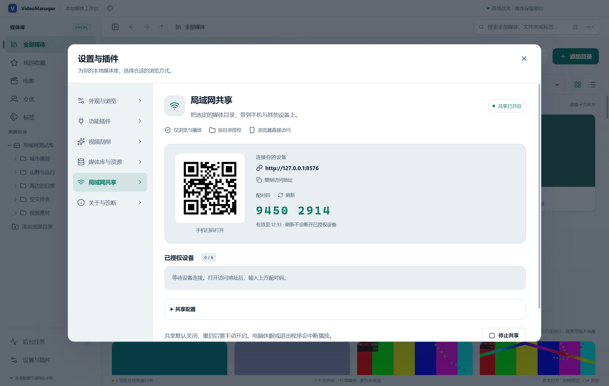
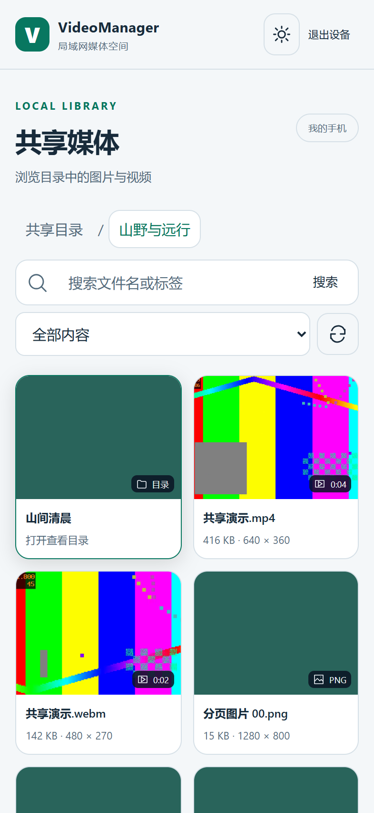

# VideoManager v0.10.0 验收记录

验收日期：2026-10-03。平台：Windows 11 x64；构建 Node 24.19.0、Electron 44.4.1。安装包和程序版本为 0.10.0，Windows ProductVersion 为 0.10.0.0。

## 交付

新增局域网目录共享与浏览器播放：选择根目录或子目录、选择私有 IPv4 网卡、二维码访问、限时配对码、设备授权与撤销、连接与播放状态、手机布局、分页与搜索、图片预览／缩放／全屏、原文件视频播放与设备独立续播，以及系统托盘继续共享。

网络服务和只读查询分别在独立进程运行。文件按流读取，封面使用现有缓存和后台优先级；授权范围覆盖目录、搜索、计数、面包屑、封面和原文件。客户端响应不含本机路径、文件身份或桌面进度。服务默认关闭，配置保留，重启后需重新开启和配对。停止服务或切换媒体库会撤销会话并关闭连接。

使用方法及实现见 [局域网共享说明](LAN_SHARING.md)，v0.9.2 的主题与性能改进继续保留。

## 自动化验证

| 检查 | 结果 |
| --- | --- |
| TypeScript 与生产构建 | 通过 |
| 单元与集成测试 | 14 个测试文件、79 项全部通过；其中新增共享测试 18 项 |
| 最终打包程序共享回归 | 19 个场景全部通过 |
| 最终打包程序原有媒体管理回归 | 17 个场景全部通过 |
| 最终打包程序主题回归 | 11 个场景全部通过 |
| Chromium／mpv 播放与渲染检查 | 通过，未发现渲染页面异常 |
| NSIS 载荷一致性 | 7 个核心文件的 SHA-256 与接受测试的 win-unpacked 程序一致 |
| Git 空白检查 | 通过 |

共享回归使用隔离的测试库、真实 Windows Electron 和两个独立 Chrome 浏览器会话。触屏视口为 393 × 852，检查无横向溢出；包含 73 项共享内容的分页测试、中文名称和标签检索、MP4 H.264/AAC 与 WebM VP9/Opus 实际解码、拖动和续播、模拟视频加载中断后保留进度及恢复连接续播、图片原文件与全屏、未授权访问拒绝、未共享目录／封面／视频拒绝、刷新配对码、设备撤销与其他设备继续访问、停止端口、配置持久化、重启默认关闭、托盘隐藏与恢复、实际私有网卡地址访问和切换媒体库停止共享。

复制地址通过验证调用来源的桌面 IPC 接口写入系统剪贴板，避免放开页面剪贴板权限。测试拦截并核对 UI 提交的地址，同时调用原生写入 API；该测试进程的系统剪贴板无法读写回显，所以真实系统粘贴结果仍需实际桌面确认。

共享单元测试包含错误／过期配对码、24 小时会话到期、设备上限、退出、配对限速、伪造 Host、跨站 Origin、非法查询、写接口拒绝、Range／后缀／HEAD／416。使用 32 MiB 未完整读取的测试视频，验证撤销设备会中断现有传输并释放租约。授权查询验证移动到非共享区域后拒绝访问、离线状态、归档根目录、分页不泄漏计数、面包屑不泄漏未共享祖先。

原有媒体回归包含目录索引、网格／列表、多选、标签／收藏、本地分段播放、精确选帧与封面保存、清缓存和重扫、目录重命名与移动、隔离样本进入回收站、管理包导出／导入／重绑及重启持久化。主题回归继续使用 verify-v092.mjs 验证当前 v0.10.0 程序的主题行为。

旧 query-benchmark.test.ts 会在并行性能测试刚创建空库时读取最新目录，导致 `no such table: entries`。已改为寻找完成的十万条索引，并将复测结果写入独立报告。播放器测量脚本原先在 UI 提交异步关闭后立即读进度，可能早于数据库落盘；已等待持久化完成，确认保存位置为 1 秒。

## 性能采样

同一桌面空闲视图、每次 2 秒、共享关闭／开启的主线程任务耗时分别为 1.31 ms／0.26 ms，两次均为 0 个持续动画。此处仅用于确认没有引入界面持续运行任务；不把采样差异解释为共享开启提升性能，不包含共享进程、GPU 或实际网络负载。

另一组 44 项媒体样本、多选 12 项、2 秒空闲采样：主线程 9.19 ms，样式计算 0.14 ms，持续动画 0。Chromium 打开样本 3 次为 297, 42, 46 ms；本轮 mpv 打开为 3578 ms，空闲尺寸读取 0 次。暂停、定位、速度、音量、窗口缩放、全屏、关闭和保存 1 秒进度均通过。打开耗时受系统与媒体缓存影响，不能作为所有文件、冷启动或网络视频的速度承诺。

现有十万媒体／一万目录数据库基准继续通过；属于数据库服务与首批 100 项查询，不代表十万项真实界面、扫描或网络吞吐验收。

## 安装包

- 文件：`VideoManager-0.10.0-Windows-x64-Setup.exe`
- 大小：186,331,874 bytes（约 177.7 MiB）
- SHA-256：`d1ec5efb59cd1264d4393aeb9b779e37c1c88556ba7e88abb589e63cae4fb7c8`
- 构建：Windows x64 NSIS，沿用未签名配置。
- 保留 v0.9.2 安装包；v0.10.0 同时归档到 `release/v0.10.0/`。

从 NSIS 安装包提取并核对了程序、app.asar、托盘图标、原生播放器宿主、播放器控制脚本、mpv 和第三方许可；app.asar 包含共享 worker、只读数据库 worker 与全部浏览器静态资源。未执行安装向导或覆盖个人安装目录。

## 测试范围与后续

本次手机为浏览器触屏模拟，未进行物理 Android／iPhone、跨机器防火墙、Wi-Fi 丢包与带宽、4K 高码率或长时多设备负载测试。实际网卡访问是在同一电脑访问自己的私有地址。首次使用仍需在真实设备上确认网络可达和编码兼容性。

本版提供可信局域网内的 HTTP 原文件播放。没有服务端转码、转封装、外置字幕、HTTPS 配置、DLNA 或公网访问配置。配对不提供传输加密。客户端已经取得的内容无法通过撤销授权收回。

## 可复现命令与报告

```powershell
npm run build
npm test
$env:VM_TEST_EXECUTABLE = (Resolve-Path release/win-unpacked/VideoManager.exe).Path
$env:VM_UI_LABEL = 'packaged'
npm run test:sharing
npm run test:e2e
node scripts/verify-v092.mjs
$env:VM_UI_LABEL = 'v0100-packaged'
node scripts/ui-performance.mjs
node scripts/verify-release.mjs
```

生成报告：`test-results/v0100-unit-tests.json`、`sharing-packaged-report.json`、`e2e-report.json`、`v0100-theme-regression.json`、`ui-performance-v0100-packaged.json`、`v0100-package-payload.json`；生成报告位于忽略目录，当前文档记录接受的结果。




