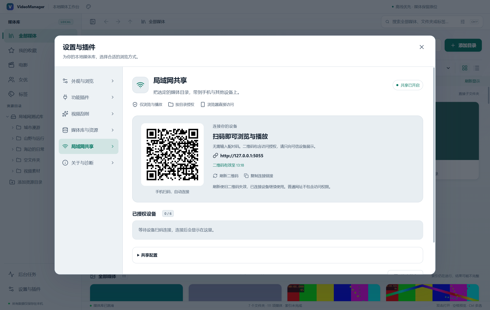
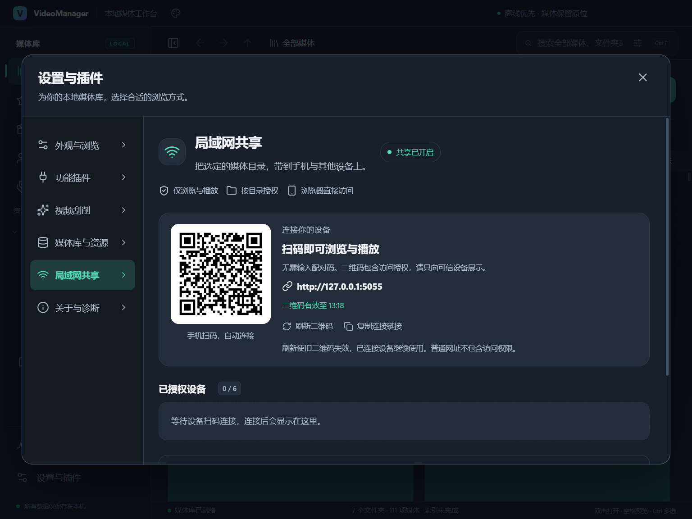
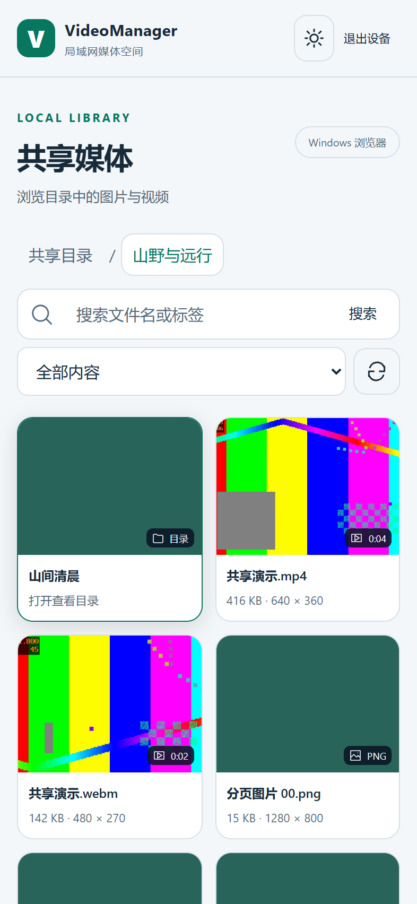

# VideoManager v0.10.1 验收记录

验收日期：2026-10-03。平台：Windows 11 x64；构建 Node 24.19.0、Electron 44.4.1。程序与安装包版本为 0.10.1，Windows ProductVersion 为 0.10.1.0。

## 交付

局域网共享改为扫码自动连接，取消手动配对码和设备名称输入。二维码包含 256 位随机授权凭证，有效期 10 分钟；浏览器自动验证、清理地址栏中的凭证，并取得独立的 24 小时设备会话。设备名称由浏览器环境生成。重复扫码或刷新页面复用已有会话，不增加设备名额。

普通共享网址只显示扫码提示，不能浏览目录、获取封面或播放媒体。刷新二维码使旧链接失效，已连接设备继续使用。撤销单台设备会中断其访问并轮换二维码，防止该设备使用之前的扫码链接重新授权；其他设备继续使用。电脑端提供「复制连接链接」，包含与二维码相同的授权信息。

共享设置改为二维码、连接说明、有效时间与操作按钮；手机连接页面去掉输入表单，显示扫码步骤和可读错误。保留目录范围检查、搜索、分页、图片预览、原文件视频播放、续播、设备限制、托盘与重启默认关闭行为。

README、[局域网共享说明](LAN_SHARING.md) 和版本记录已更新；v0.9.2 安装包仍保留于 release/v0.9.2。最终检查未在当前交付目录找到 v0.10.0 原安装包，该版本的历史验收记录保留于源码文档中。

## 自动化验证

| 检查 | 结果 |
| --- | --- |
| TypeScript 与生产构建 | 通过 |
| 单元与集成测试 | 14 个文件、83 项全部通过；其中共享测试 22 项 |
| 最终打包程序共享回归 | 25 个场景全部通过 |
| 最终打包程序媒体管理回归 | 17 个场景全部通过 |
| 最终打包程序主题回归 | 11 个场景全部通过 |
| NSIS 载荷一致性 | 7 个核心文件的 SHA-256 与接受测试的 win-unpacked 程序一致 |
| Git 空白检查 | 通过 |

共享回归使用隔离媒体库、真实 Windows Electron 与 Chrome 浏览器会话。扫码流程通过打开二维码对应的完整连接链接模拟，验证无输入自动授权、地址栏片段清理、资源请求 URL 和本地存储不保留二维码凭证、设备 Cookie 与二维码凭证不同、普通网址／查询参数／无效凭证拒绝访问、旧二维码失效、重复扫码复用授权、撤销后旧链接不能重新授权、新二维码重新授权，以及主动退出释放名额。

包含 393 × 852 触屏视口、1024 像素桌面深色布局无横向溢出、73 项内容分页、中文搜索、共享范围限制、MP4 H.264/AAC 与 WebM VP9/Opus 实际解码、拖动／续播、视频加载失败后保留进度、Range／HEAD／416、图片缩放与全屏、托盘、配置持久化、重启默认关闭、实际私有网卡自访问与切换媒体库关闭共享。页面无未处理异常。

服务端测试验证 256 位随机值、仅 POST 正文交换、旧配对接口不能授权、请求提交完成后检查到期时间、10 分钟凭证过期与 24 小时会话过期分别生效、设备上限、连接限速、同源／Host 防护、只读接口、范围查询及撤销未完成传输后释放租约。

复制按钮验证 UI 经受验证的桌面 IPC 提交正确的完整连接链接，并调用原生剪贴板写入 API。当前测试进程无法读写系统剪贴板回显，实际粘贴结果需桌面确认。

原有媒体回归覆盖索引、网格／列表、标签／收藏、图片与视频、封面、重扫、重命名／移动／回收站、媒体库导入导出与重绑、重启持久化。主题回归使用原 verify-v092.mjs 验证当前 v0.10.1 程序的自定义颜色、预设、键盘、深浅色和保存行为。

共享测试曾在新建根目录的 `online` 状态出现后立即读取子目录，早于索引完成。已将共享与媒体回归的初次等待条件改为 `lastIndexedAt > 0`，确保先完成索引与封面。小窗口检查恢复主题时采用 `system` 默认值，避免测试向设置接口提交尚未保存的 `undefined`。

## 性能采样

同一桌面空闲视图、每次 2 秒、共享关闭／开启时主线程任务分别为 2.13 ms／0.29 ms，样式和布局采样均为 0 ms，持续动画均为 0。该检查用于确认共享没有新增持续界面动画；不把采样差异解释为性能提升，不包含共享进程、GPU 或网络吞吐负载。既有十万媒体数据库基准通过；不代表大库真实界面或局域网带宽验收。

## 安装包

- 文件：`VideoManager-0.10.1-Windows-x64-Setup.exe`
- 大小：186,332,665 bytes（约 177.7 MiB）
- SHA-256：`ab03d5831eb77b9825eddac9c1c13b12737eb52d4a4a10f5336e85af85fd4e23`
- 构建：Windows x64 NSIS，沿用未签名配置。
- 归档：`release/v0.10.1/`，包含安装包、blockmap、校验值、版本、说明与截图。

验证 NSIS 内嵌 7-Zip 载荷的头部与目录校验后提取程序、app.asar、托盘图标、原生播放器宿主、播放器控制脚本、mpv 和第三方许可，7 个文件均与接受测试的打包程序一致。未运行安装向导或覆盖个人安装目录。

## 使用范围

二维码和完整连接链接都是访问凭证，获得者在有效期内可以连接；普通 IP／端口网址不包含权限。二维码在扫码工具中的保存／转发不受应用控制。服务使用可信局域网 HTTP，扫码授权不提供传输加密。

本次手机为 Chrome 触屏视口模拟，未进行物理 Android／iPhone 相机扫码、扫码工具保留 URL 片段、跨机器防火墙、Wi-Fi 吞吐量或长时多设备负载验收。实际网卡访问是在同一电脑访问自己的私有 IPv4 地址。真实手机仍需确认扫码工具保留完整链接、网络可达和视频编码兼容性。

## 可复现命令与报告

```powershell
npm run build
npm test
$env:VM_TEST_EXECUTABLE = (Resolve-Path release/win-unpacked/VideoManager.exe).Path
$env:VM_UI_LABEL = 'v0101-packaged'
npm run test:sharing
npm run test:e2e
node scripts/verify-v092.mjs
node scripts/verify-release.mjs
```

生成报告位于忽略的 test-results：`v0101-unit-tests.json`、`sharing-v0101-packaged-report.json`、`v0101-media-regression.json`、`v0101-theme-regression.json`、`v0101-package-payload.json`。当前文档记录接受的结果。






