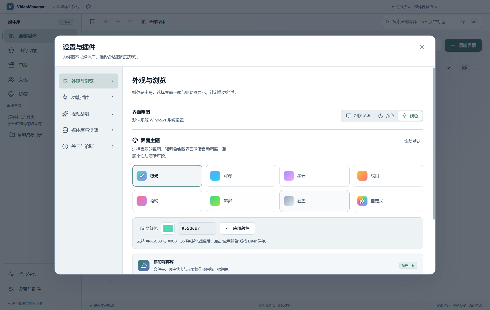

# VideoManager v0.9.2 更新与验收记录

验收日期：2026-10-03（UTC+8）。平台：Windows x64。应用、安装包、打包后的 package.json 与 Windows 文件版本均为 0.9.2。

## 功能与视觉改进

- 保留 Aceternity 风格的静态主题渐变与光晕，移除大面积模糊、无限极光动画、逐字 Motion 动画、全局鼠标聚光灯与逐卡片流光边框。移除不再使用的 Motion、Tailwind CSS 及其 Vite 插件依赖。
- 统一中文系统字体、字重、图标线宽、按钮圆角、导航选中状态、媒体卡片边框与深浅配色；设置页采用两行主题预设、明确的颜色编辑区、当前主题预览与键盘焦点。
- 自定义主题可从任意预设首次启用。颜色选择器与文字输入共享草稿；支持六位、三位十六进制颜色以及大小写与空白归一化；点击应用或 Enter 明确保存，无效输入有错误提示。失焦不再与应用按钮竞争。
- 强调色相对主要表面的对比度以及主要按钮文字对比度至少为 4.5:1，极端黑白和高饱和自定义色纳入自动化测试。主题随系统明暗变化并在重启后保留。
- 网格通过 React.memo 避免因打开弹窗或更新任务重复渲染。保存外观设置不再重建媒体查询；保存状态提示不再挤动设置页。
- mpv 使用 ResizeObserver、窗口缩放、滚动、可视视口与全屏事件同步原生画面尺寸，取消逐帧 getBoundingClientRect 轮询；播放弹窗仅淡入，不缩放或移动原生画面坐标。
- 清缓存会等待已有缩略图写入，并阻止新请求在清理期间写入，修复 ENOTEMPTY 竞争；手动封面对象保持独立。

## 验证结果

| 验证 | 结果 |
| --- | --- |
| TypeScript 严格类型检查、生产构建 | 通过 |
| 单元、集成、原生合同及性能测试 | 12 个文件、61 项全部通过 |
| 最终打包程序桌面端到端回归 | 17 个场景全部通过 |
| 最终打包程序主题回归 | 11 个场景全部通过 |
| Chromium 实际视频 | MP4 H.264/AAC、WebM VP9/Opus 播放通过 |
| mpv 实际视频与控制 | 播放进度推进、暂停、定位、倍速、音量、窗口同步、全屏、关闭和进度保存通过 |
| 封面、缓存、文件与媒体库 | 真实帧前后步进、保存、清缓存、重扫保护、重命名、移动、回收站、管理包导入导出及重启恢复通过 |
| 布局 | 深浅主题、1024×720 设置页无横向溢出、1280×720 浏览及播放器通过 |
| 渲染异常 | 三组打包程序回归均无 pageerror |
| NSIS 安装包 | 构建完成，核心载荷 SHA-256 与回归使用的 win-unpacked 一致 |

旧测试中的搜索范围、步进不传当前帧时间和 saveCover 缺少质量参数，已按现有产品行为及界面实际调用更新；查询注入、源身份校验、逐帧 PTS、封面保护等断言继续保留。

## 性能测量

同机生产构建，隔离的 44 项媒体样本，多选 12 项。记录 2 秒空闲期间的 Chromium Performance 指标，不包含 GPU 时间。基线测量只用于多选网格对比；视频数据是优化版本的实际测量，不作前后速度提升声明。

| 指标 | 优化前 | 优化后生产构建 | 最终打包程序 |
| --- | ---: | ---: | ---: |
| 空闲主线程 TaskDuration | 561.62 ms | 26.54 ms | 30.85 ms |
| 样式重计算 | 156.67 ms | 0.69 ms | 1.56 ms |
| 持续动画数量 | 17 | 0 | 0 |
| mpv 空闲尺寸读取 / 2 秒 | 原实现逐帧轮询 | 0 | 0 |

渲染器 JavaScript 从约 802.66 kB 降至 649.28 kB（约减少 19%）；CSS 从 92.71 kB 降至 81.55 kB。最终包 Chromium 打开样本三次约为 301 / 49 / 75 ms，mpv 首次启动约为 3565 ms，关闭后保存的位置为 1 秒。播放器首次启动包含进程初始化与解码，实际耗时会随磁盘、编码和系统负载变化。

## 安装包

- 文件：`release/VideoManager-0.9.2-Windows-x64-Setup.exe`
- 大小：186,299,806 字节，约 177.7 MiB。
- SHA-256：`5242310c5af2e1afe8d2d4339029ac8f7abb47f0f8428d7f6965d00d5ecba26f`
- 数字签名：沿用项目配置，未签名。
- 通过解出安装包中的 app.asar、VideoManager.exe、mpv、原生窗口宿主及播放器脚本并比较 SHA-256，确认载荷与已通过回归的程序完全一致。本轮未自动化操作安装向导。

## 复测与证据

```powershell
npm test
node scripts/verify-v092.mjs
node scripts/ui-performance.mjs
powershell -ExecutionPolicy Bypass -File scripts/build.ps1
$env:VM_TEST_EXECUTABLE = 'release/win-unpacked/VideoManager.exe'
node scripts/e2e.mjs
node scripts/verify-v092.mjs
$env:VM_UI_LABEL = 'packaged'
node scripts/ui-performance.mjs
node scripts/verify-release.mjs
```

使用 Node.js 22.12 或以上。所有回归使用隔离的 `.test-data`。真实视频测试依赖已生成的 `.test-data/fixtures`，初始化说明见历史交付报告。

本机原始报告位于 `test-results/v092-unit-tests.json`、`v092-regression.json`、`e2e-report.json`、`ui-performance-baseline.json`、`ui-performance-optimized.json`、`ui-performance-packaged.json` 和 `v092-package-payload.json`。这些测试产物不提交到 Git。



